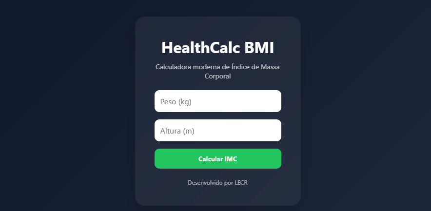

# 🧮 HealthCalc BMI

Aplicação web moderna para cálculo do **IMC (Índice de Massa Corporal)** desenvolvida com **HTML5, CSS3 e JavaScript puro**.

Projeto criado com foco em prática de **lógica de programação**, **manipulação do DOM** e **organização de código front-end**, contribuindo para a construção de um portfólio profissional.

---

## 🚀 Funcionalidades

✔ cálculo automático do IMC
✔ classificação por faixa corporal
✔ validação de entrada do usuário
✔ interface moderna e responsiva
✔ código organizado e modular
✔ estrutura preparada para evolução futura

---

## 📸 Preview do projeto




---

## 📊 Fórmula aplicada

IMC = peso / altura²

---

## 📂 Estrutura do projeto
```
healthCalc-bmi
│
├── index.html
├── README.md
│
├── assets
│   ├── css
│   │   └── style.css
│   │
│   ├── js
│   │   └── script.js
│   │
│   └── images
│
└── docs
└── preview.png
```
---

## 🧪 Tecnologias utilizadas

* HTML5
* CSS3
* JavaScript ES6

---

## 🎯 Objetivo do projeto

Este projeto foi desenvolvido com finalidade educacional para praticar:

* manipulação do DOM
* eventos JavaScript
* lógica de programação
* organização de estrutura front-end
* criação de interfaces modernas

---

## 🔮 Melhorias futuras

* adicionar modo escuro (dark mode)
* incluir animações com CSS
* salvar histórico de cálculos
* criar versão com React

---

## 👩‍💻 Desenvolvido por

**Loren Conde**
